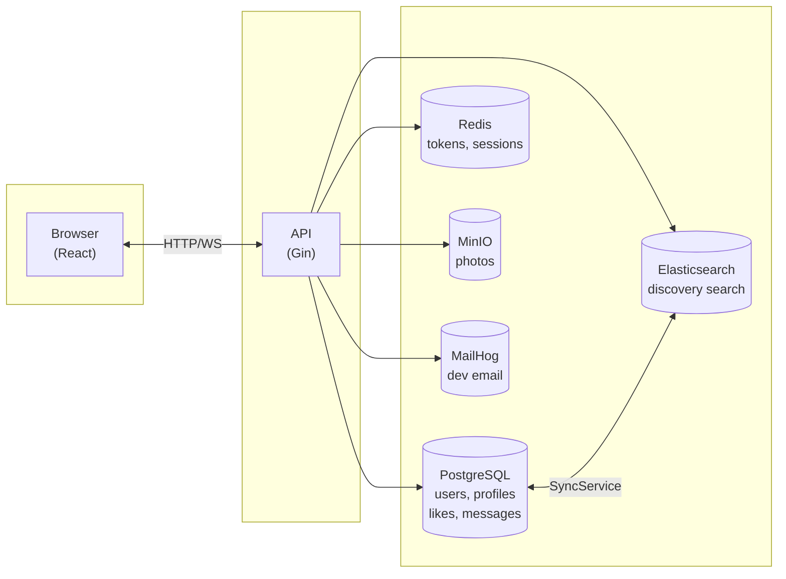

# Matcha

A dating app with user discovery, likes, matches, real-time chat, and notifications.

## Tech Stack

| Component | Technology |
|-----------|------------|
| Backend | Go 1.24, Gin |
| Frontend | React 18, Vite, Tailwind CSS |
| Database | PostgreSQL 16 |
| Cache / tokens | Redis 7 |
| Search | Elasticsearch 8 |
| Photo storage | MinIO |
| Email (dev) | MailHog |
| WebSocket | gorilla/websocket |

## Architecture

### High-level overview



### API layer

```
Handlers (HTTP)  →  Services (business logic)  →  Repositories (data access)
     │                        │
     │                        ├── TokenStore (Redis)
     │                        ├── MinIO (storage)
     │                        ├── SyncService (PostgreSQL ↔ Elasticsearch)
     │                        └── Mailer (SMTP)
     │
     └── WebSocket Hub  →  ChatHandler (real-time messages, presence)
```

### Component roles

| Component | Role |
|-----------|------|
| **PostgreSQL** | Primary data store: users, profiles, likes, messages, notifications, reports, blocks, presence |
| **Redis** | Email verification tokens, password reset tokens, session data |
| **Elasticsearch** | Full-text search for discovery (tags, city, bio). Synced from PostgreSQL via SyncService |
| **MinIO** | S3-compatible object storage for user photos |
| **MailHog** | Dev SMTP capture; emails visible at :8025 |
| **WebSocket** | Real-time chat, presence updates, notifications |

### Request flow (example: like a user)

1. Frontend sends `POST /api/v1/users/:id/like` with JWT
2. Auth middleware validates token, presence middleware updates online status
3. LikesHandler → LikeRepository (insert) → NotificationRepository (create) → Mailer (optional email) → WebSocket Hub (push to recipient)
4. Response + recipient gets real-time notification

## Project Structure

```
ft_matcha/
├── api/                    # Go API
│   ├── cmd/api/            # Entry point
│   ├── internal/
│   │   ├── config/         # Configuration
│   │   ├── database/       # Migrations, connection pool
│   │   ├── handlers/       # HTTP handlers
│   │   ├── middleware/     # Auth, presence
│   │   ├── repository/     # Repositories (PostgreSQL)
│   │   ├── search/         # Elasticsearch
│   │   ├── services/       # Auth, mailer, sync, seed
│   │   ├── storage/        # MinIO
│   │   ├── store/          # Redis (tokens)
│   │   ├── validation/     # Validation
│   │   └── websocket/      # WebSocket chat
│   └── e2e/                # E2E tests
├── frontend/               # React SPA
│   └── src/
│       ├── api/            # API client
│       ├── components/     # Layout, ProtectedRoute
│       ├── context/        # Auth, Notifications
│       └── pages/          # App pages
├── scripts/                # Scripts (set-lan-ip)
├── docker-compose.yml      # Production
├── docker-compose.dev.yml  # Dev with hot reload
├── Makefile
└── .env
```

## Features

- **Registration & login** — email, password, email verification, password reset
- **Profile** — bio, tags, city, preferences, search
- **Discovery** — user search with filters (Elasticsearch)
- **Likes** — likes, mutual likes (matches)
- **Chat** — real-time messaging (WebSocket)
- **Photos** — upload, delete, primary photo (MinIO)
- **Notifications** — likes, matches, messages
- **Reports & blocks** — user reports, blocking
- **Presence** — online status

## Quick Start

### Requirements

- Docker and Docker Compose
- (Optional) Go 1.24, Node.js 18+ — for local development without Docker

### 1. Clone and configure

```bash
cd ft_matcha
cp .env.example .env
# Edit .env if needed
```

### 2. Run with Docker (production mode)

```bash
make up
# or with rebuild:
make rebuild
```

- **API:** http://localhost:8080  
- **Frontend:** http://localhost:3000  
- **Swagger:** http://localhost:8080/swagger/index.html  
- **MailHog:** http://localhost:8025  
- **MinIO Console:** http://localhost:9001  

### 3. Development mode (hot reload)

**Option A — infrastructure only in Docker:**

```bash
make dev-infra
```

In separate terminals:

```bash
# Terminal 1 — API (requires air: go install github.com/air-verse/air@latest)
cd api && air

# Terminal 2 — Frontend
cd frontend && npm run dev
```

**Option B — everything in Docker with hot reload:**

```bash
docker compose -f docker-compose.yml -f docker-compose.dev.yml up
```

## Makefile

| Command | Description |
|---------|-------------|
| `make up` | Start all services |
| `make down` | Stop services |
| `make rebuild` | Rebuild and start |
| `make dev-infra` | Infrastructure only: postgres, redis, elasticsearch, minio, mailhog |
| `make dev-api` | Infra + API with air |
| `make dev` | Infra + hints for api/frontend |
| `make logs` | All service logs |
| `make api-logs` | API logs |
| `make ps` | Container status |
| `make test` | Go tests |
| `make e2e` | E2E tests |
| `make lan-ip` | Update .env for LAN access (mobile devices) |

## Environment Variables (.env)

| Variable | Description | Default |
|----------|-------------|---------|
| `API_PORT` | API port | 8080 |
| `FRONTEND_PORT` | Frontend port | 3000 |
| `POSTGRES_PORT` | PostgreSQL port | 5432 |
| `REDIS_PORT` | Redis port | 6379 |
| `ELASTICSEARCH_PORT` | Elasticsearch port | 9200 |
| `MINIO_PORT` | MinIO port | 9000 |
| `MAILHOG_UI_PORT` | MailHog UI port | 8025 |
| `JWT_SECRET` | JWT secret | change_me_in_production |
| `VITE_API_URL` | API URL for frontend | http://localhost:8080 |
| `CORS_ORIGIN` | Allowed origin | http://localhost:3000 |

For mobile access over Wi‑Fi, run `make lan-ip` — it will set your machine's IP in `.env`.

## API

- Swagger UI: `GET /swagger/index.html`
- Health: `GET /health`
- Ping: `GET /api/v1/ping`

Main endpoint groups:

- `/api/v1/auth/*` — register, login, email verification, password reset
- `/api/v1/profile/*` — current user profile
- `/api/v1/users/*` — search, likes, messages, blocks
- `/api/v1/photos/*` — photo upload and management
- `/api/v1/likes/*`, `/api/v1/matches` — likes and matches
- `/api/v1/notifications/*` — notifications
- `GET /api/v1/ws/chat` — WebSocket for chat

## Testing

```bash
# Unit tests
make test

# E2E (requires running API and MailHog)
make e2e
```

## License

Educational project (ft_matcha).
